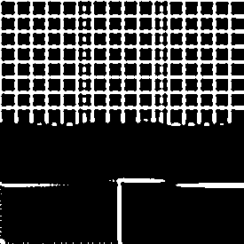
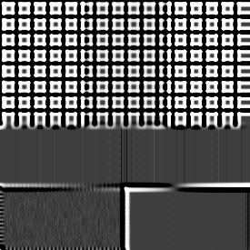
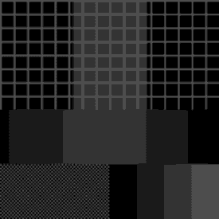
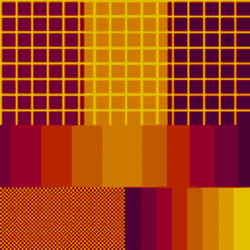
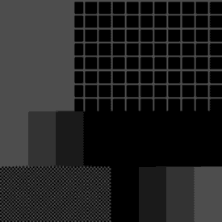
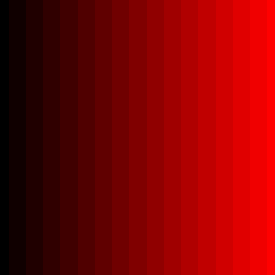
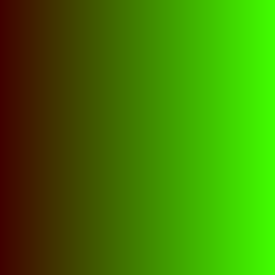

# AcerolaShaders

Android ports of shader effects by Garrett Gunnell (Acerola), written in AGSL and run through `RuntimeShader`. The project follows [AcerolaFX](https://github.com/GarrettGunnell/AcerolaFX), [CRT-Shader](https://github.com/GarrettGunnell/CRT-Shader), and [Post-Processing](https://github.com/GarrettGunnell/Post-Processing).

## Quick start

Clone the repository and install the sample app on a device or emulator that runs Android 14 (API 34) or higher.

```bash
git clone https://github.com/soulcramer/AcerolaShaders.git
cd AcerolaShaders
./gradlew :app:installDebug
```

Gradle resolves the required JDK on first run through the Foojay toolchain plugin.

## Modules

| Module | Purpose | Published |
|---|---|---|
| `app` | Compose sample app. Shows each shader on a drawable or on a photo-picker image. | No |
| `colorblindness` | Compose modifier (`Modifier.colorBlindness`) for the colour-blindness shader, and its AGSL source as a Kotlin string (`ColorBlindnessShader`). | Yes |
| `crt` | Compose modifier (`Modifier.crt`) for the CRT shader, and its AGSL source as a Kotlin string (`CrtShader`). | Yes |
| `differenceofgaussians` | Compose modifier (`Modifier.differenceOfGaussians`) for the difference of Gaussians shader, and its AGSL sources as Kotlin strings (`DifferenceOfGaussiansBlurShader`, `DifferenceOfGaussiansThresholdShader`). | Yes |
| `paletteswap` | Compose modifier (`Modifier.paletteSwap`) for the palette swap shader, two palette generators (`randomPalette` and `oklchPalette`), and its AGSL source as a Kotlin string (`PaletteSwapShader`). | Yes |
| `shaders-core` | The `RenderPassChain` helper, which chains `RuntimeShader` passes into one render effect. | Yes |
| `shaders-bom` | Bill of materials for the published libraries. | Yes |

## Ported effects

| Effect | Upstream source | Status |
|---|---|---|
| Colour blindness simulation (protanomaly, deuteranomaly, tritanomaly) | `AcerolaFX_ColorBlindness.fx` in AcerolaFX | Ported |
| CRT screen (barrel warp, scanline colour fringing, vignette) | `AcerolaFX_CRT.fx` in AcerolaFX | Ported |
| Difference of Gaussians edge lines | `DifferenceOfGaussians.shader` in Post-Processing | Ported |
| Palette swap (colour quantisation by luminance or red channel) | `AcerolaFX_PaletteSwap.fx` in AcerolaFX | Ported |

The colour-blindness effect lives in the `colorblindness` library, the CRT effect lives in the `crt` library, the difference of Gaussians effect lives in the `differenceofgaussians` library, and the palette swap effect lives in the `paletteswap` library.

## Use the colour-blindness shader

Add the BOM, then the library, to a module that uses Jetpack Compose. No stable release exists yet. The current version is `1.0.0-SNAPSHOT`.

```kotlin
dependencies {
    implementation(platform("app.soulcramer.shaders:shaders-bom:<version>"))
    implementation("app.soulcramer.shaders:colorblindness")
}
```

Apply the `colorBlindness` modifier to the content to filter. The `severity` lambda returns a value from 0 (no deficiency) to 1 (full deficiency). The modifier calls it only when it updates the graphics layer, so a change to the state that the lambda reads updates the filter without a recomposition.

```kotlin
var severity by remember { mutableFloatStateOf(0.6f) }

Image(
    painter = painter,
    contentDescription = null,
    modifier = Modifier.colorBlindness(type = ColorBlindnessType.Deuteranomaly, severity = { severity }),
)
```

To use the shader outside this modifier, build a `RuntimeShader` from the exposed AGSL source and set its uniforms:

```kotlin
val runtimeShader = RuntimeShader(ColorBlindnessShader)
runtimeShader.setFloatUniform("severity", severity)
runtimeShader.setIntUniform("colorblindType", type.code) // 0 = Protanomaly, 1 = Deuteranomaly, 2 = Tritanomaly
```

The shader reads its input from the `composable` child shader. Pass `composable` as the uniform name to `RenderEffect.createRuntimeShaderEffect`, or set a child shader with `setInputShader`.

The images below are the Paparazzi reference images for `ColorBlindnessScreenshotTest`. A change to the shader or the modifier fails the test until the images are recorded again.

| Case | Image | Shows |
|---|---|---|
| `original` |  | The unfiltered sample image: red, green, and blue grids, a hue gradient, a chequerboard, and a grey ramp. |
| `protanomaly` |  | Full protanomaly (severity 1). Red and green shift towards olive and yellow; blue stays close to its original hue. |
| `deuteranomaly` |  | Full deuteranomaly (severity 1). Similar to protanomaly: red and green both shift towards yellow. |
| `tritanomaly` |  | Full tritanomaly (severity 1). Red stays close to its original hue; green shifts towards cyan and blue towards teal. |
| `deuteranomalySeverity50` |  | Deuteranomaly at severity 0.5, halfway between `original` and `deuteranomaly`. |

## Use the CRT shader

Add the BOM, then the library, to a module that uses Jetpack Compose.

```kotlin
dependencies {
    implementation(platform("app.soulcramer.shaders:shaders-bom:<version>"))
    implementation("app.soulcramer.shaders:crt")
}
```

Apply the `crt` modifier to the content to filter. Every parameter has the AcerolaFX default, and `CrtDefaults` holds these values. The `curvature`, `vignetteWidth`, `lineStrength`, and `brightnessAdjust` parameters are lambdas. The modifier calls them only when it updates the graphics layer, so a change to the state that they read updates the effect without a recomposition. The `lineSize` parameter is a plain `Int`, because it changes in whole steps.

```kotlin
var curvature by remember { mutableFloatStateOf(CrtDefaults.CURVATURE) }

Image(
    painter = painter,
    contentDescription = null,
    modifier = Modifier
        .clipToBounds()
        .crt(curvature = { curvature }, lineSize = 1),
)
```

| Parameter | Range | Default | Effect |
|---|---|---|---|
| `curvature` | 1 to 10 | 10 | A higher value warps the screen less. |
| `vignetteWidth` | 1 to 100 | 30 | Width of the darkened edges, in pixels. |
| `lineSize` | 0 to 4 | 0 | Scales the scanline spacing by 2 to the power of this value. |
| `lineStrength` | 1 to 5 | 1 | Strength of the scanlines. |
| `brightnessAdjust` | -1 to 1 | 0 | Adds to the brightness of the scanlines. |

The scanline spacing follows the screen density, so the lines keep the same physical size on every screen. Outside the curved screen, the effect draws opaque black. Inside it, the effect keeps the alpha of the content.

To use the shader outside this modifier, build a `RuntimeShader` from `CrtShader`. The KDoc of `CrtShader` lists its uniforms. The shader also reads its input from the `composable` child shader.

The images below are the Paparazzi reference images for `CrtScreenshotTest`. A change to the shader or the modifier fails the test until the images are recorded again.

| Case | Image | Shows |
|---|---|---|
| `defaults` |  | `Modifier.crt()` with every `CrtDefaults` value, including `lineSize` 0. The barrel warp and vignette show; the scanlines are thin. |
| `lineSize2` |  | `lineSize = 2`. The scanlines widen into bands with visible colour fringing. |

## Use the difference of Gaussians shader

Add the BOM, then the library, to a module that uses Jetpack Compose.

```kotlin
dependencies {
    implementation(platform("app.soulcramer.shaders:shaders-bom:<version>"))
    implementation("app.soulcramer.shaders:differenceofgaussians")
}
```

Apply the `differenceOfGaussians` modifier to the content to filter. With the defaults, the modifier draws white edge lines on black. Every parameter has the `DifferenceOfGaussians.cs` default, and `DifferenceOfGaussiansDefaults` holds these values. The `sigma`, `sigmaScale`, `tau`, `phi`, and `threshold` parameters are lambdas, for the same reason as the `crt` modifier. The `kernelRadius`, `thresholding`, `tanh`, and `invert` parameters are plain values, because they change in whole steps or as toggles. The modifier keeps the alpha of the content.

```kotlin
var sigma by remember { mutableFloatStateOf(DifferenceOfGaussiansDefaults.SIGMA) }

Image(
    painter = painter,
    contentDescription = null,
    modifier = Modifier
        .clipToBounds()
        .differenceOfGaussians(sigma = { sigma }),
)
```

| Parameter | Range | Default | Effect |
|---|---|---|---|
| `kernelRadius` | 1 to 10 | 5 | Radius of the blur, in pixels. |
| `sigma` | 0.1 to 5 | 2 | Standard deviation of the first Gaussian blur. |
| `sigmaScale` | 0.1 to 5 | 1.6 | Scale from `sigma` to the standard deviation of the second Gaussian blur. |
| `tau` | 0.01 to 5 | 1 | Weight of the second Gaussian in the difference. |
| `thresholding` | on or off | on | When on, a value at or above `threshold` becomes white and every other value becomes black. |
| `tanh` | on or off | off | When on and `thresholding` is on, a value below `threshold` falls off smoothly instead of becoming black. |
| `phi` | 0.01 to 100 | 1 | Steepness of the `tanh` fall-off. |
| `threshold` | -1 to 1 | 0.005 | Threshold of the difference. |
| `invert` | on or off | off | When on, the modifier inverts the result. |

To use the shaders outside this modifier, build a `RuntimeShader` from `DifferenceOfGaussiansBlurShader` for the first pass and `DifferenceOfGaussiansThresholdShader` for the second pass. The KDoc of each lists its uniforms. [`RenderPassChain`](#chain-shader-passes) chains the two passes.

The images below are the Paparazzi reference images for `DifferenceOfGaussiansScreenshotTest`. A change to the shaders or the modifier fails the test until the images are recorded again.

| Case | Image | Shows |
|---|---|---|
| `defaults` |  | `Modifier.differenceOfGaussians()` with every `DifferenceOfGaussiansDefaults` value. White grid lines show on black, with a soft horizontal line and two blocks where the sample image has a hard edge. |
| `tanhInvert` |  | `tanh = true`, `phi = 50`, `invert = true`. The same grid lines show in black on a light grey background, with soft, grey fall-off instead of hard edges. |

## Use the palette swap shader

Add the BOM, then the library, to a module that uses Jetpack Compose.

```kotlin
dependencies {
    implementation(platform("app.soulcramer.shaders:shaders-bom:<version>"))
    implementation("app.soulcramer.shaders:paletteswap")
}
```

Apply the `paletteSwap` modifier to the content to filter. The modifier replaces the colour of each pixel with one entry of `palette`, chosen by `index`. `PaletteSwapDefaults` holds the default `palette` and `index`. Use `randomPalette` to generate a palette from a seed. Use `oklchPalette` to generate a palette from a hue and a chroma.

```kotlin
val palette = remember { randomPalette(seed = 0, count = 8, hueMode = PaletteSwapHueMode.Complementary) }

Image(
    painter = painter,
    contentDescription = null,
    modifier = Modifier
        .clipToBounds()
        .paletteSwap(palette = palette),
)
```

| Parameter | Range | Default | Effect |
|---|---|---|---|
| `palette` | 1 to 16 colours | four greys at 0, 0.1, 0.2, and 0.3 | Colour of each band, from the lowest value to the highest. |
| `index` | `Luminance` or `Red` | `Luminance` | Value of the content that selects the band for each pixel. |

`randomPalette` generates a palette from a seed, as the generator in the Acerola video [I tried to make a better color palette generator](https://www.youtube.com/watch?v=fv-wlo8yVhk). It picks a random hue, chroma, and lightness, and it adds equal increments in the OKLCH colour space. With the defaults, the lightness goes from dark at the first colour to light at the last colour. When a colour is outside sRGB, the generator reduces its chroma until the colour fits, and it keeps the lightness and the hue. Thus the darkest and the lightest colours get less chroma, because the sRGB gamut is narrow at both ends. It then converts each colour to sRGB. It clamps `seed` and `count` to their ranges below, and it does not clamp the five contrast and colour ranges.

| Parameter | Range | Default | Effect |
|---|---|---|---|
| `seed` | 0 to 1,000,000,000 | 0 | Selects the base hue and one value from each range below. |
| `count` | 3 to 16 | 4 | Number of colours in the palette. |
| `hueMode` | `Monochromatic`, `Analogous`, `Complementary`, `TriadicComplementary`, or `TetradicComplementary` | `Monochromatic` | How much of the colour wheel the hues use. |
| `hueContrast` | any `Float` range | 0 to 1 | Hue increase from the first colour to the last, in turns of the colour wheel, before `hueMode` multiplies the increase by its factor. The factor of `Monochromatic` is 0, so every colour has the base hue. |
| `luminance` | any `Float` range | 0.2 to 0.3 | OKLCH lightness of the first colour. |
| `luminanceContrast` | any `Float` range | 0.5 to 0.6 | Lightness increase from the first colour to the last. |
| `chroma` | any `Float` range | 0.12 to 0.20 | OKLCH chroma of the first colour, before the generator reduces it to fit sRGB. |
| `chromaContrast` | any `Float` range | 0 to 0 | Chroma increase from the first colour to the last. |

`oklchPalette` generates a palette from a base hue and a base chroma, with no seed. Its `hueMode` is a colour harmony, not the hue increase of `randomPalette`. Each mode gives a set of hues, from the base hue: `Monochromatic` gives the base hue only, `Analogous` adds 30° and -30°, `Complementary` adds 180°, `TriadicComplementary` adds 120° and 240°, and `TetradicComplementary` adds 90°, 180°, and 270°. The base hue takes the middle entries. The other hues take the entries outward from the middle, with the hue above the base hue on the dark side and the hue below the base hue on the light side, so the palette is symmetric about the middle. The 180° hue is the same on both sides, so it takes the darkest and the lightest entries. For example, 8 colours in `TetradicComplementary` from a base hue of 25° have the hues 205°, 115°, 115°, 25°, 25°, 295°, 295°, and 205°. When `count` is small, the outermost hues are not in the palette. The lightness and the chroma use the same steps, the same chroma reduction, and the same sRGB conversion as `randomPalette`. The same arguments always give the same palette.

```kotlin
val palette = remember(hue, chroma) { oklchPalette(hue = hue, chroma = chroma, count = 8) }
```

| Parameter | Range | Default | Effect |
|---|---|---|---|
| `hue` | 0 to 1, values outside wrap | none | Base OKLCH hue of the middle colours, in turns of the colour wheel. |
| `chroma` | 0 or more, negative values clamp to 0 | none | OKLCH chroma of the first colour, before the generator reduces it to fit sRGB. |
| `count` | 3 to 16 | 4 | Number of colours in the palette. |
| `hueMode` | as in `randomPalette` | `Monochromatic` | Colour harmony that gives the hues of the palette. |
| `luminance` | any `Float` | 0.25 | OKLCH lightness of the first colour. |
| `luminanceContrast` | any `Float` | 0.55 | Lightness increase from the first colour to the last. |
| `chromaContrast` | any `Float` | 0 | Chroma increase from the first colour to the last. |

Each default of `luminance`, `luminanceContrast`, and `chromaContrast` is the midpoint of the matching `randomPalette` range.

This port keeps five deviations from `AcerolaFX_PaletteSwap.fx`:

- By default, the index mode reads the luminance of the content, not the red channel that upstream reads.
- The palette holds up to 16 caller colours, not the 8 manual colours that upstream allows.
- The modifier keeps the alpha of the content, not the alpha of 1 that upstream writes.
- `randomPalette` reduces the chroma of each colour outside sRGB until the colour fits, and it applies the sRGB transfer function. Upstream writes the linear values to the screen with no transfer function. Thus a seed does not give the same colours as in AcerolaFX.
- The `luminance`, `luminanceContrast`, `chroma`, and `chromaContrast` defaults differ from the upstream defaults of 0 to 1. With the upstream defaults, most colours are outside sRGB and the palette is not in order from dark to light. With the new defaults and the chroma reduction, every palette for seeds 0 to 20, all hue modes, and 4, 8, or 16 colours goes from dark to light, and each colour keeps its hue within 2 degrees.

To use the shader outside this modifier, build a `RuntimeShader` from `PaletteSwapShader` and set its uniforms. The KDoc of `PaletteSwapShader` lists the layout of the `palette` array. `PaletteSwapIndex.code` gives the `indexMode` value for each mode.

```kotlin
val runtimeShader = RuntimeShader(PaletteSwapShader)
runtimeShader.setFloatUniform("palette", values) // 64 floats: red, green, blue, and alpha of each of the 16 entries
runtimeShader.setIntUniform("count", palette.size)
runtimeShader.setIntUniform("indexMode", PaletteSwapIndex.Red.code) // 0 = Luminance, 1 = Red
```

The shader reads its input from the `composable` child shader.

The images below are the Paparazzi reference images for `PaletteSwapScreenshotTest`. A change to the shader or the modifier fails the test until the images are recorded again.

| Case | Image | Shows |
|---|---|---|
| `defaults` |  | `Modifier.paletteSwap()` with every `PaletteSwapDefaults` value. The image shows only the four default greys, 0, 26, 51, and 77, that is the default palette from 0 to 0.3. |
| `randomPalette` |  | `Modifier.paletteSwap(randomPalette(seed = 0, count = 8, hueMode = PaletteSwapHueMode.Complementary))`. The image shows eight saturated colours in order of lightness, from a dark wine, (76, 0, 51), through crimson, red, and orange to a golden yellow, (226, 190, 0). The dark parts of the sample image take the wine and the light parts take the yellow. |
| `redIndex` |  | `Modifier.paletteSwap(index = PaletteSwapIndex.Red)` with the default palette. The image differs from `defaults` on the colour parts of the sample image, because the red channel, not the luminance, selects the band there. |

## Chain shader passes

`RenderPassChain`, in the `shaders-core` library, applies a list of `RuntimeShader` passes in order as one render effect. Pass 0 reads the content, and each later pass reads only the output of the previous pass. The chain sets `size` on every pass and caches the built effect, so a caller gets a new effect only when the width, the height, or the caller's own uniform value changes. `DifferenceOfGaussiansNode` uses it to chain the blur pass and the threshold pass.

The chain also supports a one-pass effect added back onto the original content, through `RenderEffect.createBlendModeEffect(RenderEffect.createOffsetEffect(0f, 0f), chain, BlendMode.PLUS)` with `BlendMode.PLUS`.

The images below are the Paparazzi reference images for `RenderPassChainScreenshotTest`.

| Case | Image | Shows |
|---|---|---|
| `ramp` |  | A two-pass chain: pass 1 writes a red ramp from 0 to 1/16, and pass 2 scales it back to the full range. The output shows 17 distinct bands, from the 8-bit store between the passes. |
| `blendPlus` |  | A one-pass green ramp, added onto a `0x40` red background with `BlendMode.PLUS`. The left edge stays dark red and olive, and the right edge is bright green. |

A probe on a Pixel 8 Pro (API 37) rendered the `ramp` case at 256 x 16 px and counted 17 distinct red values across the row, with a maximum difference of 8 out of 255 from the expected ramp value. Paparazzi gave the same 17 bands. This matches 8-bit premultiplied RGBA intermediates, where each store rounds a value by up to 0.5 / 255. Later chained ports use 8-bit intermediates. The difference of Gaussians modifier uses two passes and one store, so its own error is at most `(1 + tau) × 0.5 / 255`, below its default threshold of 0.005.

## Build and verify

```bash
./gradlew assembleDebug          # build the app and the libraries
./gradlew spotlessCheck          # check formatting
./gradlew lintDebug              # run Android Lint on every module
./gradlew :dokkaGenerate         # generate API docs for the published libraries
./gradlew recordPaparazziDebug   # record the shader screenshot references
./gradlew verifyPaparazziDebug   # compare the shaders against the recorded references
./gradlew globalCiUnitTest       # unit tests and screenshot verification for every module, as CI runs them
```

`testDebugUnitTest` alone runs the unit tests but does not compare screenshots. CI runs `globalCiUnitTest` from [`.github/workflows/screenshots.yml`](.github/workflows/screenshots.yml) on each pull request.

## Requirements

- A device or emulator that runs Android 14 (API 34) or higher. The app and the library set minSdk 34. `RuntimeShader` needs API 33.
- The Gradle wrapper (9.8.0). The build turns on isolated projects.
- A JDK that Gradle can resolve through the Foojay toolchain plugin. The daemon pins JetBrains Runtime 25 and downloads it automatically.

## Credits

The shaders are ports of effects from [AcerolaFX](https://github.com/GarrettGunnell/AcerolaFX) and [Post-Processing](https://github.com/GarrettGunnell/Post-Processing), both by Garrett Gunnell (Acerola) and both under the MIT licence. [CRT-Shader](https://github.com/GarrettGunnell/CRT-Shader) shows the same CRT effect in Unity, but this project copies no code from it.

## Licence

MIT. See [the LICENSE file](LICENSE), which also contains the AcerolaFX copyright notice.
