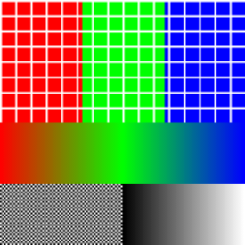
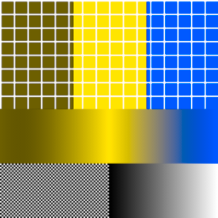
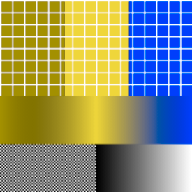
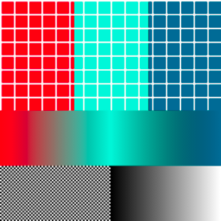
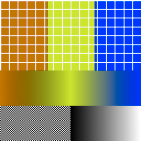
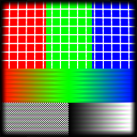
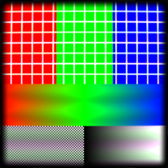

# AcerolaShaders

Android ports of shader effects by Garrett Gunnell (Acerola), written in AGSL and run through `RuntimeShader`. The project follows [AcerolaFX](https://github.com/GarrettGunnell/AcerolaFX) and [CRT-Shader](https://github.com/GarrettGunnell/CRT-Shader).

## Quick start

Clone the repository and install the sample app on a device or emulator that runs Android 14 (API 34) or higher.

```bash
git clone https://github.com/soulcramer/AcerolaShaders.git
cd AcerolaShaders
./gradlew :app:installDebug
```

Gradle resolves the required JDK on first run through the Foojay toolchain plugin.

## Modules

| Module | Purpose | Published |
|---|---|---|
| `app` | Compose sample app. Shows each shader on a drawable or on a photo-picker image. | No |
| `colorblindness` | Compose modifier (`Modifier.colorBlindness`) for the colour-blindness shader, and its AGSL source as a Kotlin string (`ColorBlindnessShader`). | Yes |
| `crt` | Compose modifier (`Modifier.crt`) for the CRT shader, and its AGSL source as a Kotlin string (`CrtShader`). | Yes |
| `shaders-bom` | Bill of materials for the published libraries. | Yes |

## Ported effects

| Effect | Upstream source | Status |
|---|---|---|
| Colour blindness simulation (protanomaly, deuteranomaly, tritanomaly) | `AcerolaFX_ColorBlindness.fx` in AcerolaFX | Ported |
| CRT screen (barrel warp, scanline colour fringing, vignette) | `AcerolaFX_CRT.fx` in AcerolaFX | Ported |

The colour-blindness effect lives in the `colorblindness` library and the CRT effect lives in the `crt` library.

## Use the colour-blindness shader

Add the BOM, then the library, to a module that uses Jetpack Compose. No stable release exists yet. The current version is `1.0.0-SNAPSHOT`.

```kotlin
dependencies {
    implementation(platform("app.soulcramer.shaders:shaders-bom:<version>"))
    implementation("app.soulcramer.shaders:colorblindness")
}
```

Apply the `colorBlindness` modifier to the content to filter. The `severity` lambda returns a value from 0 (no deficiency) to 1 (full deficiency). The modifier calls it only when it updates the graphics layer, so a change to the state that the lambda reads updates the filter without a recomposition.

```kotlin
var severity by remember { mutableFloatStateOf(0.6f) }

Image(
    painter = painter,
    contentDescription = null,
    modifier = Modifier.colorBlindness(type = ColorBlindnessType.Deuteranomaly, severity = { severity }),
)
```

To use the shader outside this modifier, build a `RuntimeShader` from the exposed AGSL source and set its uniforms:

```kotlin
val runtimeShader = RuntimeShader(ColorBlindnessShader)
runtimeShader.setFloatUniform("severity", severity)
runtimeShader.setIntUniform("colorblindType", type.code) // 0 = Protanomaly, 1 = Deuteranomaly, 2 = Tritanomaly
```

The shader reads its input from the `composable` child shader. Pass `composable` as the uniform name to `RenderEffect.createRuntimeShaderEffect`, or set a child shader with `setInputShader`.

The images below are the Paparazzi reference images for `ColorBlindnessScreenshotTest`. A change to the shader or the modifier fails the test until the images are recorded again.

| Case | Image | Shows |
|---|---|---|
| `original` |  | The unfiltered sample image: red, green, and blue grids, a hue gradient, a chequerboard, and a grey ramp. |
| `protanomaly` |  | Full protanomaly (severity 1). Red and green shift towards olive and yellow; blue stays close to its original hue. |
| `deuteranomaly` |  | Full deuteranomaly (severity 1). Similar to protanomaly: red and green both shift towards yellow. |
| `tritanomaly` |  | Full tritanomaly (severity 1). Red stays close to its original hue; green shifts towards cyan and blue towards teal. |
| `deuteranomalySeverity50` |  | Deuteranomaly at severity 0.5, halfway between `original` and `deuteranomaly`. |

## Use the CRT shader

Add the BOM, then the library, to a module that uses Jetpack Compose.

```kotlin
dependencies {
    implementation(platform("app.soulcramer.shaders:shaders-bom:<version>"))
    implementation("app.soulcramer.shaders:crt")
}
```

Apply the `crt` modifier to the content to filter. Every parameter has the AcerolaFX default, and `CrtDefaults` holds these values. The `curvature`, `vignetteWidth`, `lineStrength`, and `brightnessAdjust` parameters are lambdas. The modifier calls them only when it updates the graphics layer, so a change to the state that they read updates the effect without a recomposition. The `lineSize` parameter is a plain `Int`, because it changes in whole steps.

```kotlin
var curvature by remember { mutableFloatStateOf(CrtDefaults.CURVATURE) }

Image(
    painter = painter,
    contentDescription = null,
    modifier = Modifier
        .clipToBounds()
        .crt(curvature = { curvature }, lineSize = 1),
)
```

| Parameter | Range | Default | Effect |
|---|---|---|---|
| `curvature` | 1 to 10 | 10 | A higher value warps the screen less. |
| `vignetteWidth` | 1 to 100 | 30 | Width of the darkened edges, in pixels. |
| `lineSize` | 0 to 4 | 0 | Scales the scanline spacing by 2 to the power of this value. |
| `lineStrength` | 1 to 5 | 1 | Strength of the scanlines. |
| `brightnessAdjust` | -1 to 1 | 0 | Adds to the brightness of the scanlines. |

The scanline spacing follows the screen density, so the lines keep the same physical size on every screen. Outside the curved screen, the effect draws opaque black. Inside it, the effect keeps the alpha of the content.

To use the shader outside this modifier, build a `RuntimeShader` from `CrtShader`. The KDoc of `CrtShader` lists its uniforms. The shader also reads its input from the `composable` child shader.

The images below are the Paparazzi reference images for `CrtScreenshotTest`. A change to the shader or the modifier fails the test until the images are recorded again.

| Case | Image | Shows |
|---|---|---|
| `defaults` |  | `Modifier.crt()` with every `CrtDefaults` value, including `lineSize` 0. The barrel warp and vignette show; the scanlines are thin. |
| `lineSize2` |  | `lineSize = 2`. The scanlines widen into bands with visible colour fringing. |

## Build and verify

```bash
./gradlew assembleDebug          # build the app and the libraries
./gradlew spotlessCheck          # check formatting
./gradlew lintDebug              # run Android Lint on every module
./gradlew :dokkaGenerate         # generate API docs for the published libraries
./gradlew recordPaparazziDebug   # record the shader screenshot references
./gradlew verifyPaparazziDebug   # compare the shaders against the recorded references
./gradlew globalCiUnitTest       # unit tests and screenshot verification for every module, as CI runs them
```

`testDebugUnitTest` alone runs the unit tests but does not compare screenshots. CI runs `globalCiUnitTest` from [`.github/workflows/screenshots.yml`](.github/workflows/screenshots.yml) on each pull request.

## Requirements

- A device or emulator that runs Android 14 (API 34) or higher. The app and the library set minSdk 34. `RuntimeShader` needs API 33.
- The Gradle wrapper (9.8.0). The build turns on isolated projects.
- A JDK that Gradle can resolve through the Foojay toolchain plugin. The daemon pins JetBrains Runtime 25 and downloads it automatically.

## Credits

The shaders are ports of effects from [AcerolaFX](https://github.com/GarrettGunnell/AcerolaFX) by Garrett Gunnell (Acerola), which uses the MIT licence. [CRT-Shader](https://github.com/GarrettGunnell/CRT-Shader) shows the same CRT effect in Unity, but this project copies no code from it.

## Licence

MIT. See [the LICENSE file](LICENSE), which also contains the AcerolaFX copyright notice.
